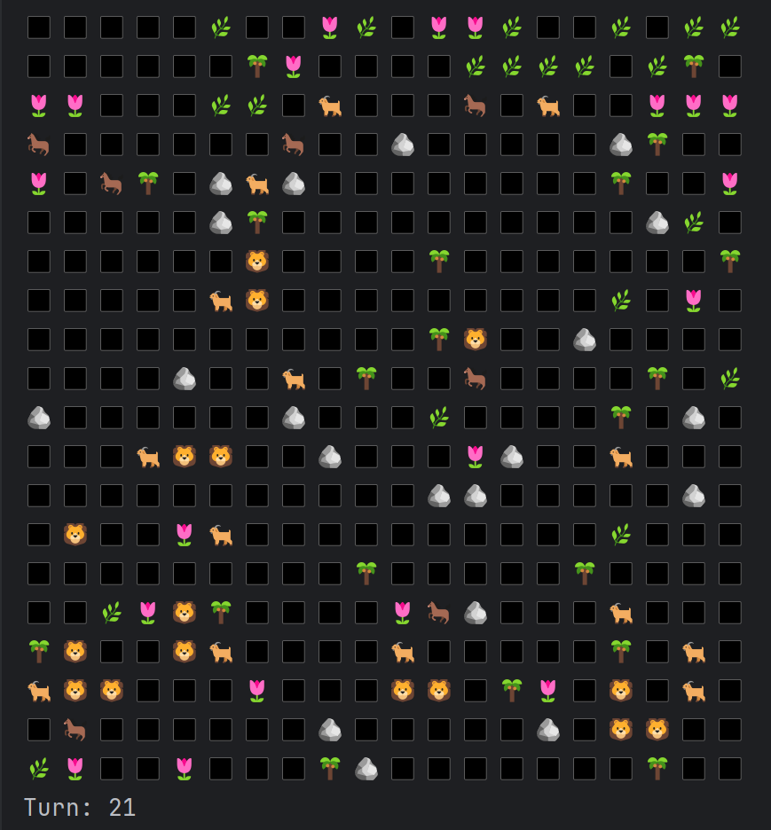

# Simulation 2D

## Overview

Simulation 2D is a Java-based console simulation that models a world with various entities, including predators,
herbivores and environmental elements. The simulation progresses in turns, with entities interacting with each other
and their environment based on predefined rules.

## Implemented Features

- **Entity System**:
    - Various types of entities including predators, herbivores and environmental elements
    - Entities have unique behaviors and interact with each other (e.g., predators hunt herbivores, herbivores eat
      resources)

- **World Map**:
    - A grid-based world where entities are placed
    - Entities have coordinates and can move around the map

- **Simulation Lifecycle**:
    - The simulation progresses in turns with a pause and resume functionality implemented using multithreading
    - Commands for controlling the simulation (start, pause/resume, quit)
    - The simulation ends when there are no more herbivores left

- **Rendering**:
    - Console-based rendering of the world map and entities
    - Visual representation of entities using emojis

- **Action System**:
    - Different actions such as spawning entities, moving creatures and resource regeneration
    - Initialization actions and turn-based actions

- **Pathfinding**:
    - Simple pathfinding for creatures to move towards their targets
      using [Breadth-first search](https://en.wikipedia.org/wiki/Breadth-first_search) algorithm
    - Different movement speeds for various creatures, affecting how quickly they can move across the map

## Contributing

Contributions are welcome! Please fork this repository and submit a pull request

## License

This project is licensed under the MIT License. See the LICENSE file for details

